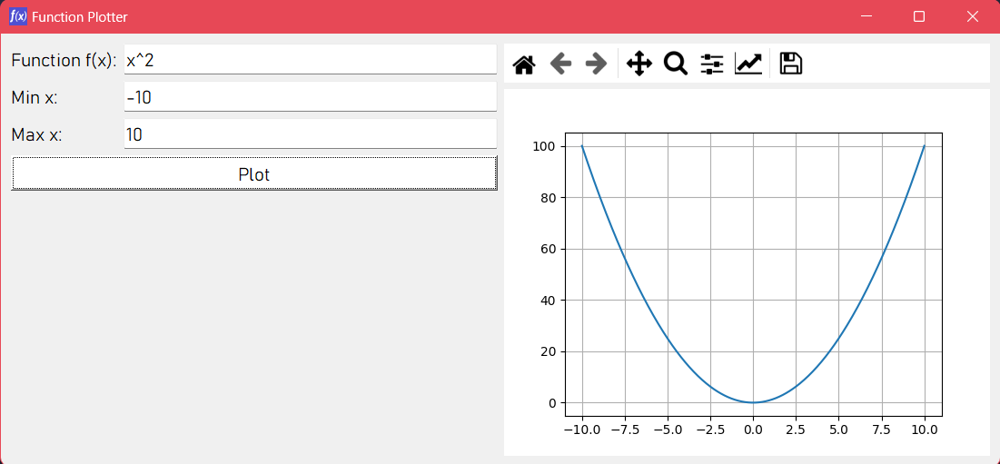
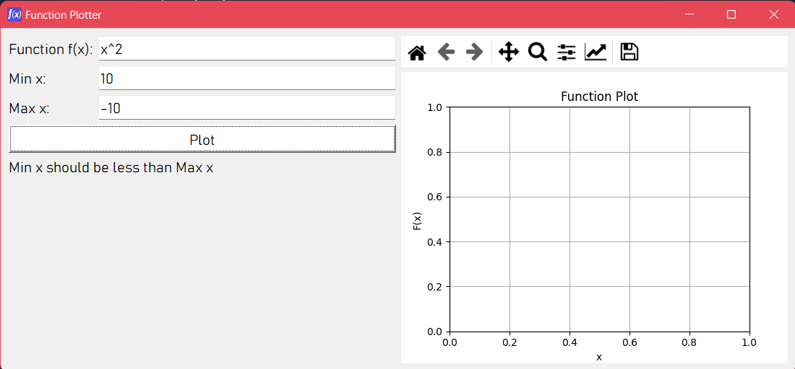

# Function Plotter

## Table of Contents
1. [Introduction](#introduction)
2. [Overview](#overview)
3. [Features](#features)
4. [Input Validation](#input-validation)
5. [Testing](#testing)
6. [Examples](#examples)

## Introduction
The Function Plotter is a Python GUI application that allows users to plot arbitrary mathematical functions. Users can input a function of x, specify the minimum and maximum values for x, and visualize the plotted function.

## Overview
1. A Python GUI program that plots an arbitrary user-entered function.
2. Take a function of x from the user, e.g., 5*x^3 + 2*x.
3. Take min and max values of x from the user.
4. Support the following operators: +, -, /, *, ^, log10(), sqrt().
5. The GUI is simple and well-organized.
6. Made using Pyside2 and Matplotlib.
7. The Matplotlib figure Embed in the Pyside2 application.
8. Contains an automated tests for the program using pytest.

## Features
- **Input Fields:** Text boxes for entering the function of x, minimum x value, and maximum x value.
- **Plot Button:** A button to plot the entered function.
- **Error Handling:** Displays error messages for invalid inputs.
- **Canvas:** A Matplotlib canvas embedded in the PySide2 application to display the plot.

## Input Validation
The application performs the following validations:
- Ensures that the minimum x value is less than the maximum x value.
- Validates the function string for correct mathematical syntax and supported operators.
- Displays appropriate error messages for invalid inputs.

## Testing
Automated tests are created using `pytest`. Tests cover the main functionalities, including function preprocessing, plotting, and handling invalid inputs.

### Test Cases
1. **Preprocess Function String:** Tests for replacing implicit multiplication, power operator, log10, and sqrt functions.
2. **Plot Function:** Tests for plotting simple and constant functions, and handling invalid ranges.

## Examples
### Valid Input
Function: `x^2`  
Min x: `-10`  
Max x: `10`  

### Invalid Input
Function: `x^2`  
Min x: `10`  
Max x: `-10`  
Error Message: `Min x should be less than Max x`

